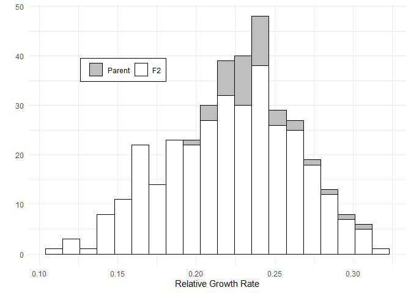

<!-- README.md is generated from README.Rmd. Please edit that file -->

# LonCalGrowthAnalysis

<!-- badges: start -->
<!-- badges: end -->

The goal of LonCalGrowthAnalysis is to document the data and analysis
conducted for: insert when paper is out.

## Installation

You can install the development version of LonCalGrowthAnalysis from
[GitHub](https://github.com/) with:

``` r
# install.packages("pak")
pak::pak("KnechtTheDots/LonCalGrowthAnalysis")
```

## Example

This is a basic example which shows you how to solve a common problem:

``` r
library(LonCalGrowthAnalysis)
# The phenotypes data set includes seedling phenotypese for 418 seedlings. 
# For example here is the distribution of F2 relative growth rates

hist(phenotypes$rgr[phenotypes$line=="F2"], main = "", xlab = "Relative Growth Rates")
```


